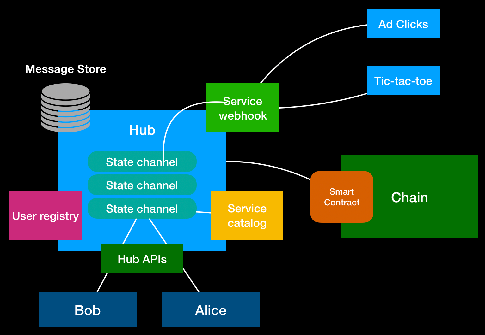

# State Channels Demo Application

## Parties involved

- Service provider (tic-tac-toe game server)

  - Host the game
  - Register with State channel hub with a
    [webhook](https://en.wikipedia.org/wiki/Webhook)

- End users (game players: Bob and Alice)

  - Register with State channel hub as users (email, public keys)

- State channel hub

  - Manage users and service providers
  - Proxy between end users and service providers to exchange signed messages
  - Manage life cycles of channels
  - Store signed messages

- Block chain
  - Settle final state of state channel on the chain
  - Resolve disputes of off-chain transactions using smart contracts

## On-chain contracts

## Off-chain interactions

## State Channel APIs

### Models

#### Channel

- address
- applicationId
- status
- ...

- create a new channel

POST /api/channels

- close a channel

DELETE /api/channels/{id}

- get status of a channel

GET /api/channels/{id}

#### Message

- channelAddress
- content
- timestamp
- nonce?

- find messages of a channel

GET /api/channels/{id}/messages

- post messages to a channel

POST /api/channels/{id}/messages

- store signed messages (private)
- forward requests to the counter-party service (tic-tac-toe game server)

#### User

- id
- email
- publicKeys

#### Application

- id
- webhook
- publicKey

## Flow

1. A service provider registers itself with the hub as an application
   `tic-tac-toe`.
2. User (Bob) sign up with the hub with 2FA and register his public keys
3. The hub publishes `tic-tac-toe` after verification of the webhook
4. Now Bob sees the `tic-tac-toe` and wants to play with Alice.
5. If Alice is not yet a user with the hub, the hub will send an invitation to
   Alice's email to invite Alice sign up with the hub and play
6. The hub creates a channel for Bob to play `tic-tac-toe`. Each instance is
   identified by the channel address/id.
7. Bod uses the front-end to send first move (signed with his private key) as an
   API request to the hub
8. The hub verifies the request using Bob's public key
9. The hub stores the signed message from Bob
10. The hub forwards the message to the `tic-tac-toe` service using the webhook,
    receives the response and passes it back to Bob
11. The hub notifies Alice?
12. Repeat the play between Alice and Bob
13. The win/lose status has reached or one of the players abort the game
14. Final state of the channel is saved
15. Close the channel
